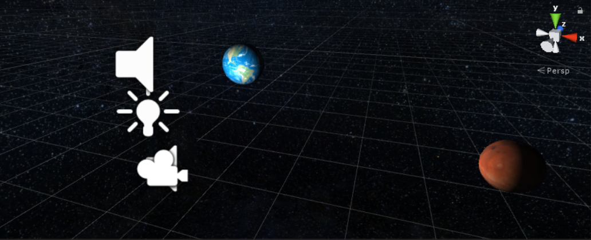

# SpaceBallsVR
Sample VR game for [Windows Mixed Reality](https://aka.ms/mr) immersive headsets where you shoot asteroids at planets. This game is used to teach Windows Mixed Reality development at conferences using a step-by-step approach. This demo was premiered at CodeMash in Sandusky, OH in in January 2018 and used in subsequent sessions and workshops at various developer events. 

This is a work in a progress that I am sharing publicly as I add features. This project is shared "as is" for educational purposes only.

* **Unity version: 2017.4.3f1**
* **Mixed Reality Toolkit version: 2017.2.1.1** [download here](https://github.com/Microsoft/MixedRealityToolkit-Unity/releases/tag/2017.2.1.1)

## Implementation Notes
* This sample works both on Windows Mixed Reality Immersive (VR) headsets and HoloLens. On HoloLens, the starry Space skybox is replaced with a black background so it's transparent.
* Use the controller Trigger button to shoot asteroids at the planets (or Air Tap on HoloLens).
* Use the Grasp (side) button on the controller to grab planets and drag them around the scene (not available on HoloLens for now).
The ParticleHolder prefab is not used in the scene. It is just a placeholder prefab to hold the preconfigured particle effect of the asteroid explosion so you can apply it to other objects.
* This sample uses Microsoft Cognitive Services for the Text-to-Speech (TTS) integration. Please refer to my [Unity Text-to-Speech](https://github.com/ActiveNick/Unity-Text-to-Speech) sample here for more information on the code behind and to obtain an API key to call this cloud API. 

## Acknowledgements
* This project uses the [Asteroids Pack](https://assetstore.unity.com/packages/3d/environments/asteroids-pack-84988) from [Mark Dion](https://assetstore.unity.com/publishers/27658). Please **do not lift these assets** directly from my sample for your own projects, get them yourself in the [Unity Asset Store here](https://assetstore.unity.com/packages/3d/environments/asteroids-pack-84988).
* Sounds and music are CC0 audio assets from [OpenGameArt.org](http://opengameart.org).

## Follow Me
* Twitter: [@ActiveNick](http://twitter.com/ActiveNick)
* Blog: [AgeofMobility.com](http://AgeofMobility.com)
* SlideShare: [http://www.slideshare.net/ActiveNick](http://www.slideshare.net/ActiveNick)
